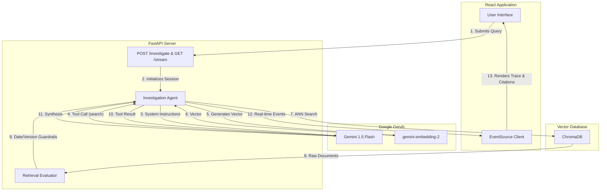

# Architecture

The Incident Investigation Agent is built on a modern, decoupled architecture designed for real-time observability of autonomous AI reasoning.

### Core Components

#### 1. React Frontend (Vite + Tailwind CSS v4)
Provides a split-pane "Internal SRE" interface. It uses native `EventSource` to consume Server-Sent Events (SSE). It handles connection drops gracefully and visually segregates the agent's "Thought Trace" from the "Final Evidence".

#### 2. FastAPI Backend
Provides a highly concurrent API. 
- `POST /investigate`: Creates an `asyncio.Queue` session.
- `GET /stream/{session_id}`: Initiates a background worker thread that executes the agent, piping real-time tool calls and results back to the client via `EventSourceResponse`. It utilizes strict idempotent session locking to prevent duplicate agent executions if the browser auto-reconnects.

#### 3. ReAct Agent Layer
Powered by the `google-genai` SDK. The agent operates autonomously in a `while` loop managed by the SDK. It is granted three strictly typed tools: `search_documents`, `synthesize_answer`, and `insufficient_evidence`. It is prompted to perform multi-hop reasoning (e.g., finding a deployment -> searching for the deployment version).

#### 4. Retrieval & Evaluation Pipeline
We use `ChromaDB` for local, persistently stored vector search. 
- **Embeddings**: Documents and queries are embedded using `gemini-embedding-2`.
- **Metadata**: Strict metadata JSON filtering prevents cross-contamination between unrelated microservices.
- **Deterministic Evaluation**: Before the LLM receives search results, `evaluator.py` intercepts the payload, mathematically comparing dates and semantic versioning to explicitly flag contradictions (e.g., an outdated runbook).

### Resilience & Error Handling
- **503 Unavailable**: Managed via the `tenacity` library using exponential backoff retries on the core `chat.send_message` function.
- **429 Rate Limits**: Explicitly caught and streamed as a user-facing error without crashing the server.
- **Event Loop Lifecycle**: The background thread safely checks `loop.is_closed()` before dispatching queue items, preventing fatal runtime exceptions when clients disconnect prematurely.
